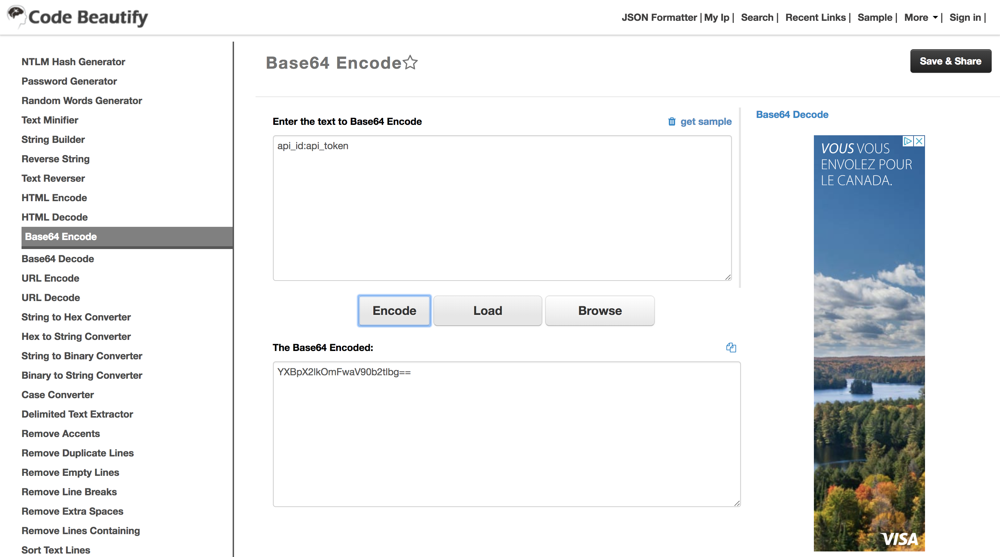

# Aircall Connector

The Aircall Connector allows you to synchronize all your users from hull into your aircall contacts list.

## Getting Started

Go to the Connectors page of your Hull organization, click the button “Add Connector” and click “Install” on the Aircall card.

## How to find your API key 

In your aircall dashboard click on `Account` in the left bar, then select `API Keys` and choose `Generate an API key`:

Aircall generates an api id and token.
Now use this two strings to transform them into an api key.
Use https://codebeautify.org/base64-encode to generate the api key from the api id and token

## Warning: Before using the connector

Aircall currently limits the rate of API requests to 60 requests per minute per company. You can remove this limit by pinging them at api@aircall.io

—

Developed with 🍵 by growth@spendesk.com
